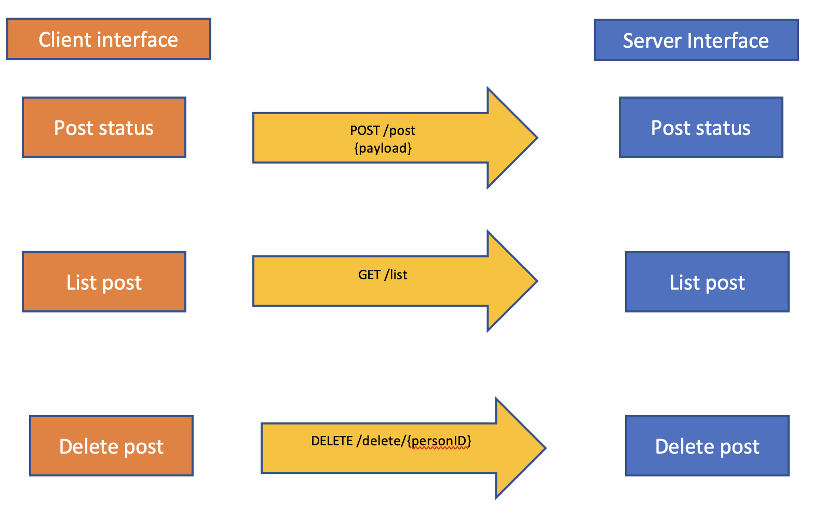

# 课后作业6
作业内容：

功能需求 - 圈子

发状态
像朋友圈一样，发布心情、感想、幽默段子
删状态
删除自己的状态
逛圈子
看看整个圈子里边最新的状态
圈子要求：
发状态的内容包含：

发布时间
发布者 ID
发布者姓名
发布状态时的：年龄、身高、体重、体脂率
圈子要求：

发布状态后，每条都要落地到数据库
删除数据时，标记圈子为不可见
逛圈子时，看不见已经“删除”的状态
## 1. Create table in DB
    CREATE TABLE `testdb`.`circle` (
    `ID` INT NOT NULL AUTO_INCREMENT,
    `timestamp` DATETIME NOT NULL,
    `person_id` INT NOT NULL,
    `person_name` VARCHAR(45) NOT NULL,
    `sex` VARCHAR(45) NOT NULL,
    `content` VARCHAR(45) NOT NULL,
    `at_time_height` FLOAT NOT NULL,
    `at_time_weight` FLOAT NOT NULL,
    `at_time_age` INT NOT NULL,
    `visible` BOOLEAN NOT NULL,
    PRIMARY KEY (`ID`));

## 2. Create protobuf file(types.proto) for Circle, tag with gorm
    syntax = "proto3";
    package apis;
    option go_package = "./";
    
    message CirCleList {
    repeated Circle items = 1;
    }
    
    message Circle {
    // @gotags: gorm:"primaryKey;column:id"
    uint32 id = 1;
    // @gotags: gorm:"column:name"
    int64  name = 2;
    // @gotags: gorm:"column:person_id"
    uint32 person_id = 3;
    // @gotags: gorm:"column:person_name"
    string person_name = 4;
    // @gotags: gorm:"column:sex"
    string sex = 5;
    // @gotags: gorm:"column:content"
    string content = 6;
    // @gotags: gorm:"column:at_time_height"
    float  at_time_height = 7;
    // @gotags: gorm:"column:at_time_weight"
    float  at_time_weight = 8;
    // @gotags: gorm:"column:at_time_age"
    uint32 at_time_age = 9;
    // @gotags: gorm:"column:visible"
    bool  visible = 10;
    }

## 3. Generate protobuf go file and inject gorm tag 
#### under apis folder
    protoc --go_out=. --plugin= types.proto
    protoc-go-inject-tag -input="*.pb.go"

## 4. Function Design Explanation

